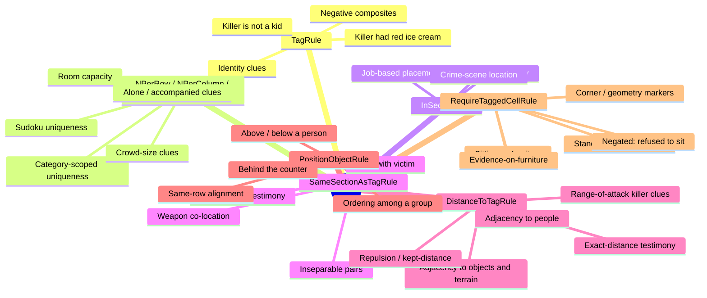

# Rules — Use-Case Catalog

A design reference for what the rule system can express, grouped by rule type. Grounded in the
concrete assets under `Assets/Scripts/Rules/RulesInstances/`.

## Attachment points

Every rule type can serve any of three contexts:

| Context | Where | Purpose |
|---|---|---|
| **Suspect clue** | `Draggable.rules` | Constrains where one specific character can be placed — the deduction puzzle |
| **Board rule** | `GridManager.boardRules` | Global constraint applied to everyone — the "sudoku" part |
| **Killer clue** | `GridManager.killerRules` | Checked against the accused suspect's final position (`EvaluateKillerRules`) — the "whodunit" part |

## Rules at a glance

## Existing instances by rule and context

Where each `RulesInstances` asset is actually referenced today (scenes and prefabs):

| Rule | Board rule | Killer clue | Suspect clue |
|---|---|---|---|
| **TagRule** | — | KillerIsNotKid, KillerIsNotVictim | — |
| **NPerRowRule** | UniquePerRow, UniqueAdultPerRow | — | UniquePerRow, UniqueAdultPerRow |
| **NPerColumnRule** | UniquePerColumn, UniqueAdultPerColumn | — | UniquePerColumn |
| **NPerSectionRule** | — | — | 2InSection, PersonAloneInSection, NotAloneInSection |
| **InSectionRule** | — | — | InSection3 |
| **SameSectionAsTagRule** | — | KillerSameSectionAsVictim | — |
| **DistanceToTagRule** | — | KillerClose2Victim | NextToBella, NextToVase, NextToRedVase, NextToBlueVase, NextToPlant, NextToFossils |
| **PositionObjectRule** | — | — | IsAboveAaron, IsAboveCounter, IsBelowCarla |
| **RequireTaggedCellRule** | — | — | OnChair, OnStool, NotOnChair, NotOnStool, OnChairRedIcecream, OnCarpet, OnCarpetBlue, OnCarpetGreen, OnCarpetYellow\*, IsOnCorner |

\* `OnCarpetYellow` exists as an asset but is not referenced by any scene or prefab yet.

The NPerRow/NPerColumn uniqueness instances appear in both the board and suspect columns because
they're assigned globally per scene *and* on the `Person`/`Victim` prefabs' own rule lists.

---

## 1. TagRule — who someone *is* (position-independent)

Checks the draggable's own tags with `Has`/`HasNot` and `All`/`Any` matching. Ignores position,
so it shines as a killer clue or as an eligibility filter combined with other rules.

| Context | Use case | Example / notes |
|---|---|---|
| Killer clue | "The killer is not a child" | `KillerIsNotKid` (`subtype: Kid`, HasNot) |
| Killer clue | "The killer is not the victim" | `KillerIsNotVictim` — sanity clue for every level |
| Killer clue | "The killer is an adult / a woman / a staff member" | Any demographic or role tag added via AddSuspectTool |
| Killer clue | "The killer wore shoes" / "was barefoot" | Witness-style tags like `hadShoesOn` |
| Killer clue | "The killer had red ice cream" | Consumable/prop tags (`icecream: red`) |
| Killer clue | "The killer wore something greenish" | Color tags letting multiple suspects match partially |
| Killer clue | "Neither a kid nor the person in blue" | Negative composite: `Any` + `HasNot` |

## 2. NPerRowRule / NPerColumnRule / NPerSectionRule — counting constraints

Count entities matching tags in a row/column/section, compared with `<` / `==` / `>` against `n`.
The sudoku backbone.

| Context | Use case | Example / notes |
|---|---|---|
| Board rule | One person per row / per column | `UniquePerRowRule`, `UniquePerColumnRule` |
| Board rule | One *adult* per row/column, kids free | `UniqueAdultPerRowRule`, `UniqueAdultPerColumnRule` — softer difficulty, same structure |
| Board rule | "No more than 2 people per section" | Room-occupancy capacity limits |
| Board rule | One of each shirt color per row; one pet per section | Attribute-scoped uniqueness |
| Suspect clue | "X was alone in a room" | `PersonAloneInSection` (others `== 0` in section) |
| Suspect clue | "X was with at least one other person" | `NotAloneInSection` (`> 0`) — witness/alibi flavor |
| Suspect clue | "X was with exactly one other person" | `2InSection` — a private conversation, a pair |
| Suspect clue | "X was in a crowded room (3+ people)" | Party scenarios |
| Suspect clue | "X was the only child in their row" | Line-of-sight style deductions |
| Killer clue | "The killer was alone" / "was with someone" | Alibi mechanics |
| Killer clue | "The killer was in a room with a kid" | Count of `subtype: Kid` `> 0` in section — sinister witness setups |

## 3. InSectionRule — absolute location

Pins placement to one specific section.

| Context | Use case | Example / notes |
|---|---|---|
| Suspect clue | "X never left the kitchen" | `InSection3` — testimony fixing a character to a room |
| Suspect clue | Chef in the kitchen, lifeguard by the pool | Job-based placement |
| Suspect clue | The trophy belongs in the gym's trophy area | Object placement |
| Killer clue | "The murder happened in the library" | Narrows suspects by room instantly |
| Killer clue | "The killer was in the crowded room" | Chain with section-scoped counting rules |

## 4. SameSectionAsTagRule — relative co-location

Must share a section with an entity matching tags.

| Context | Use case | Example / notes |
|---|---|---|
| Killer clue | "The killer was in the same room as the victim" | `KillerSameSectionAsVictim` — the canonical murder clue |
| Killer clue | "Same room as the knife / broken vase / fossils" | Weapon or evidence co-location |
| Suspect clue | "Aaron never left Bella's side" | Inseparable pairs: parent-and-child, guard-and-guarded |
| Suspect clue | "Carla was in a room with a carpet / plant" | Testimony referencing scenery rather than people |
| Suspect clue | "The dog was with its owner" | Pet mechanics |

## 5. DistanceToTagRule — proximity (three metrics)

Distance to tagged entities with Manhattan / Chebyshev / Euclidean metric, threshold comparison,
`any`/`all` quantifier. The most expressive spatial rule.

**Metric intuition:** Manhattan = "steps away" (walking); Chebyshev = "arm's reach" including
diagonals (touching, whispering); Euclidean = "within earshot/sight" radius.

| Context | Use case | Example / notes |
|---|---|---|
| Suspect clue | "X was standing next to [person]" | `NextToBella` (distance ≤ 1) |
| Suspect clue | "X was admiring the fossils / next to a vase" | `NextToFossils`, `NextToVase`; `NextToRedVase` shows tag specificity controlling ambiguity |
| Suspect clue | "X was next to a carpet / beside the rug" | Adjacent-cell **terrain**: target terrain tags with distance 1 (Manhattan = orthogonal only, Chebyshev = diagonals too). Exact-cell checks stay with RequireTaggedCellRule |
| Suspect clue | "X and Y kept their distance" | Distance ≥ 3 — repulsion, a mechanic no other rule provides |
| Suspect clue | "X stood exactly two steps from the counter" | `Equal` comparison — precise-testimony puzzles for harder levels |
| Suspect clue | "X kept away from *all* the kids" / "stood between the two vases" | `requireAll: true` variants |
| Killer clue | "The killer struck from within 2 steps of the victim" | `KillerClose2Victim` |
| Killer clue | "The killer was near the weapon" | Adjacency to a tagged object |
| Killer clue | "No adult within 2 cells of the killer" | `Greater` + `requireAll` — avoided the witnesses |

## 6. PositionObjectRule — relative direction on an axis

Row/column comparison against tagged entities, `any`/`all` quantifier.

| Context | Use case | Example / notes |
|---|---|---|
| Suspect clue | "X was north/south of [person]" | `IsAboveAaron`, `IsBelowCarla` |
| Suspect clue | "X was behind the counter / in front of the stage" | `IsAboveCounter` — furniture as a reference line gives rooms geography |
| Suspect clue | "X was to the left of the entrance" | Horizontal-axis variant for wide layouts |
| Suspect clue | "X was below *all* the adults" / "youngest in the front row" | `requireAll` against a tag group — ordering puzzles |
| Suspect clue | "X was in the same row as the buffet table" | `Equal` — alignment without full co-location |
| Killer clue | "The shot came from above" | Killer in a higher row than the victim |
| Killer clue | "The killer fled toward the left side" | Left of the counter |

## 7. RequireTaggedCellRule — what's *on* the exact cell

The target cell must (or with `negated`, must not) hold an entity with the given tags.
The terrain/furniture rule. For *adjacent* terrain, use DistanceToTagRule instead (see §5).

| Context | Use case | Example / notes |
|---|---|---|
| Suspect clue | "X was sitting" vs "X sat on *the red* chair" | `OnChair`, `OnStool`; specificity via extra tag entries |
| Suspect clue | "X stood on a carpet" + color variants | `OnCarpet`, `OnCarpetBlue/Green/Yellow` — extends to tiles, rugs, floorboards |
| Suspect clue | "X was in a corner / by a wall / in a doorway" | `IsOnCorner` — invisible cell markers (`subtype: corner`) encode geometry as terrain |
| Suspect clue | "X sat where the red ice cream was dropped" | `OnChairRedIcecream` — evidence-on-furniture, multi-tag cells |
| Suspect clue | "X refused to sit" / "stayed off the carpet" | `NotOnChair`, `NotOnStool` — `negated` exclusion terrain |
| Suspect clue | "The toddler can't be on a stool" | Accessibility flavor via negation |
| Killer clue | "Muddy footprints on a carpet" | Killer must be standing on carpet |
| Killer clue | "The chairs were all clean — the killer never sat" | Negated |

---

## Combination patterns (where the depth comes from)

Suspects hold rule *lists* and the killer check runs a separate list, so the design space is stacking:

| Pattern | How it works |
|---|---|
| **Alibi chains** | `NotAloneInSection` on a suspect + `KillerSameSectionAsVictim` — being witnessed elsewhere clears them |
| **Triangulation** | Two DistanceToTag clues ("near the vase" + "near the plant") intersect to a small region without naming a cell |
| **Sudoku + narrative** | Board-wide uniqueness forces layout; one positional clue per suspect makes it unique; the solved layout makes exactly one suspect satisfy all killer clues |
| **Partial-information tags** | Killer clues on broad tags (`color: greenish`, `hadShoesOn`) each match several suspects; the intersection of 2–3 TagRules plus one spatial clue isolates the culprit |
| **Red-herring terrain** | Multiple carpets/chairs of different colors keep an `OnCarpet` clue ambiguous until a later clue reveals the color |

## Remaining gap

There is no "same **row/column** as tag" rule (only same *section* via SameSectionAsTagRule).
PositionObjectRule with `Equal` covers alignment against a *fixed* reference, but a dedicated
SameRowAsTagRule would read better for "X was in the same row as Y" testimony if level designs
call for it. Adjacent-cell terrain, previously listed as a gap, is fully covered by
DistanceToTagRule targeting terrain tags (§5).
